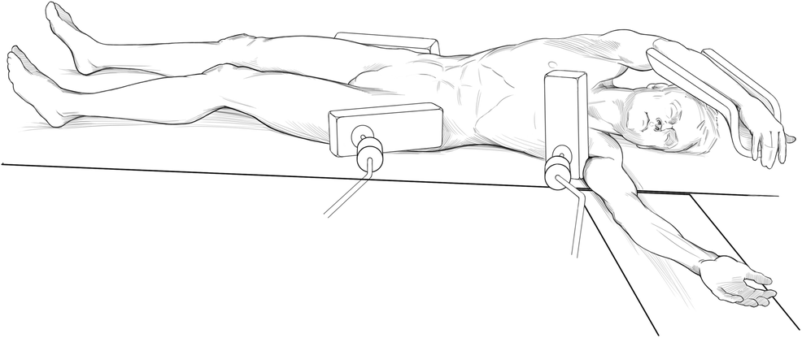
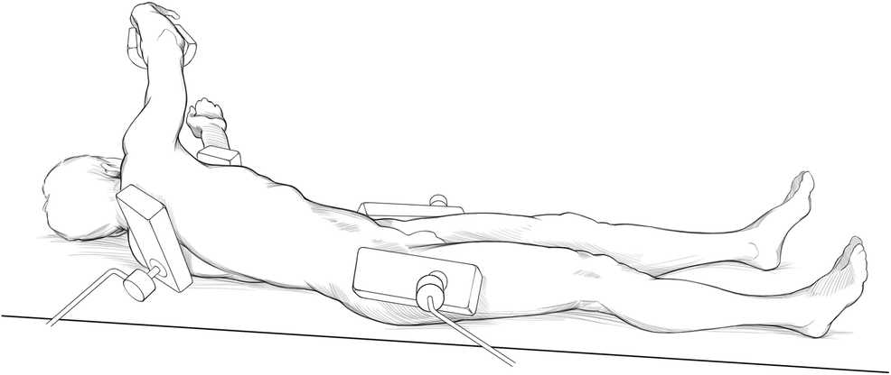
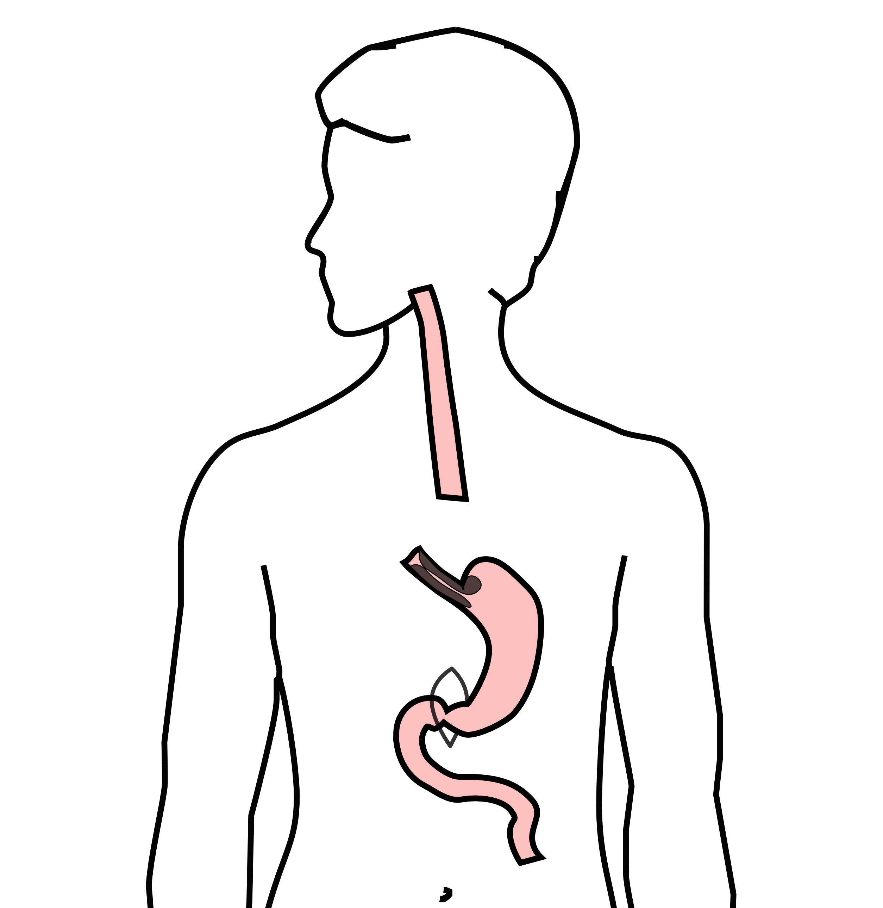
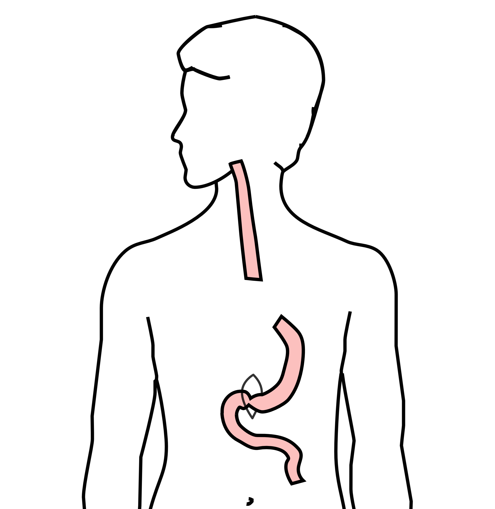
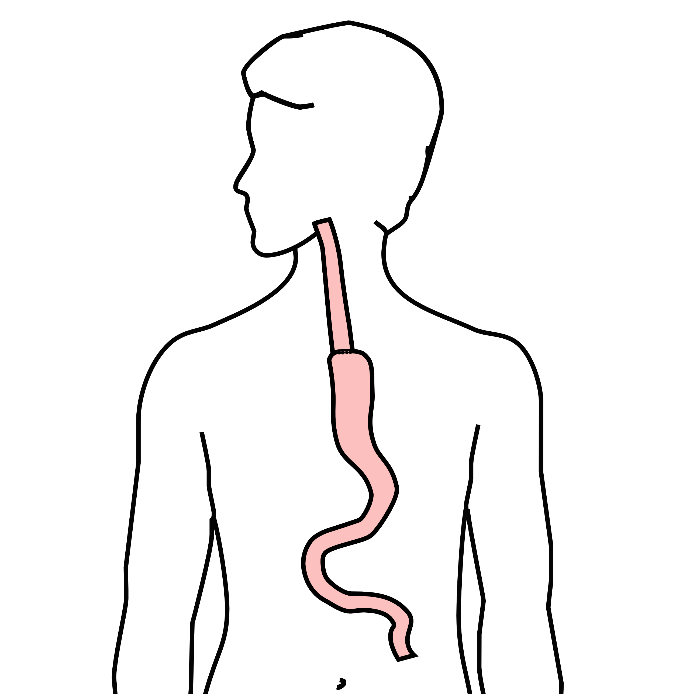
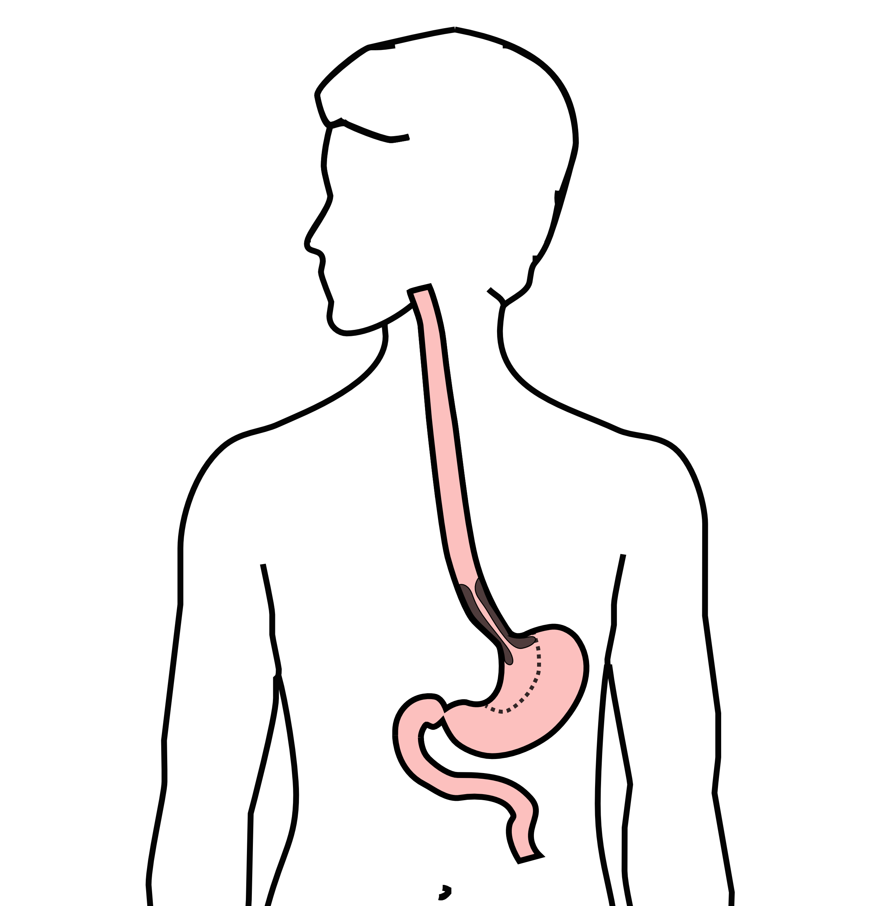

## Robotic MIE

::::: columns
::: {.column width="50%"}
Goals

- Increase lymph node harvest

- Facilitate trainee education

- No expectation of improvement in length of stay or complications
:::

::: {.column width="50%"}

:::
:::::

## One Stage MIE

Corkscrew position enables sequential abdomen $\leftrightarrow$ chest

- Abdomen I: mobilize distal esophagus
- Chest I: Divide esophagus in chest
- Abdomen II: Extracorporeal conduit $\rightarrow$ transpose conduit to chest
- Chest II: Construct anastomosis

## One Stage MIE

Allows simultaneous access to abdomen and chest in one prep

Divide esophagus in chest $\rightarrow$ extra-corporeal construction of conduit $\rightarrow$ Anastomosis

Extracorporeal construction of conduit:

- Less risk of positive distal margin
- Longer conduit (stretch during construction)

::::: columns
::: {.column width="50%"}

:::

::: {.column width="50%"}

:::
:::::

## Abdominal Phase I

- Stomach mobilized
- Left gastric artery divided
- Hiatus dissected
- Esophagus looped with Penrose
- transhiatal drain placed in left pleura

## Chest Phase I

::::: columns
::: {.column width="50%"}
- Esophagus dissected from hiatus $\rightarrow$ cephalad
- Esophagus divided
:::

::: {.column width="50%"}

:::
:::::

## Abdominal Phase II

::::: columns
::: {.column width="50%"}
- Stomach exteriorized
- Pyloromyotomy
- Conduit constructed
:::

::: {.column width="50%"}

:::
:::::

## Abdominal Phase II

::::: columns
::: {.column width="50%"}
- Stomach exteriorized
- Pyloromyotomy
- Conduit constructed
  - Place stomach on stretch
  - Palpate GE junction/lesser curvature
:::

::: {.column width="50%"}

:::
:::::

## Abdominal Phase II

::::: columns
::: {.column width="50%"}
- Stomach exteriorized
- Pyloromyotomy
- Conduit constructed
- **Conduit pushed into mediastinum**
:::

::: {.column width="50%"}

:::
:::::

## Chest Phase II

::::: columns
::: {.column width="50%"}
Anastomosis completed
:::

::: {.column width="50%"}

:::
:::::

## One Stage MIE - Conduit

- Extracorporeal construction $\rightarrow$ stretch on staple line
- Pushing conduit from abdomen $\rightarrow$ $\uparrow$ cephalad movement
- Extracorporeal construction $\rightarrow$ $\downarrow$ positive distal margin

## One Stage MIE (n=525)

- Median LOS 8 days
- 90-day mortality 6%
- Anastomotic leak 8%
- Conduit necrosis 0%

## One Stage MIE - Problems

- Trainee education - very difficult to teach
- Risk of hernia at handport site (2-5%)
- Anastomotic stricture 20%

## Robotic MIE - Expectations

- Facilitate trainee education
  - Surgical Oncology Fellowship (planned)
  - Thoracic Surgery Fellowship (August 2025)
- Facilitate lymph nodes harvest

## Robotic MIE - Challenges

Conduit construction

- Can we create a conduit of equivalent length using intracorporeal robotic technique vs extracorporeal corkscrew technique?

Anastomosis

- Circular stapled anastomosis will be easier to adopt:
  - Orvil - 25mm (Nguyen)
  - 28mm DST XL (Pittsburgh)

## Robotic vs Lap/VATS Esophagectomy Comparison

1^o^ Objective: Equivalent complications/mortality

2^o^ Objective: Improved lymph node harvest

Robotic approach will be more expensive Will need to be careful about patient selection:

- Cervical anastomosis needs extracorporeal construction of conduit

## Robotic vs Lap/VATS Esophagectomy

Can we measure intermediate endpoints for conduit quality?

- "No fly" suture at most cephalad extent of doppler signal

- Conduit quality via ICG/Spy (no quantitation)

- Tissue oximitry (experimental)

## Robotic vs Lap/VATS Esophagectomy

- Measure cephalad transposition of stomach
  - Clip at pylorus
  - Clip at right crus
- Measure reach of well-vascularized stomach
  - "No fly zone" relative to azygous vein
    - Would only work for laparoscopic cases
- Directly measure perfusion of conduit *relative to a fixed anatomic thoracic structure* (such as azygous vein)

## Robotic MIE - Hybrid A

::::: columns
::: {.column width="50%"}
Robotic abdomen: intracorporeal conduit construction

VATS chest: anastomosis with OrVil 25mm
:::

::: {.column width="50%"}

:::
:::::

## Robotic MIE - Hybrid B

::::: columns
::: {.column width="50%"}
Robotic abdomen: intracorporeal conduit construction

Robotic chest: anastomosis with OrVil 25mm
:::

::: {.column width="50%"}

:::
:::::

## Robotic MIE - Hybrid C

::::: columns
::: {.column width="50%"}
Robotic abdomen: intracorporeal conduit construction

Robotic chest: 27mm stapler with pursestring (Luketich)
:::

::: {.column width="50%"}

:::
:::::

## Robotic MIE - Metrics

- Operative experience of residents
- Anastomotic leak
- Anastomotic stricture
  - Whether dilated or not
  - How many dilations?
- Complications
  - Airway injury

## Personnel

Thoracic Surgery

- Mike Roach
- Jeff Hagen

Bariatric/MIE

- Kal Nandapati
- Paul Colavita

Surgical Oncology

- Josh Hill

## Patient Selection

- Low (distal) tumors
- Avoid tumor near carina
- Avoid proximal tumors (with cervical anastomosis)

## Obstacles - Robotic OR time

GI Surgical Oncology - Room 46: 4 weeks/month

- Hill and Salo

Salo/Roach Esophagectomy - Room 45: 1 week/month

SHVI Room 45 Wednesday - Low utilization

Open time is usually booked 10-12 weeks in advance

## Robot Block Time Grid

+----+-------------+------+-------------+-------+------------+
|    | Mon         | Tues | Weds        | Thurs | Fri        |
+====+=============+======+=============+=======+============+
| 21 |             |      |             |       |            |
+----+-------------+------+-------------+-------+------------+
| 22 |             |      |             |       |            |
+----+-------------+------+-------------+-------+------------+
| 45 | Salo/Roach\ |      | Thoracic\   |       |            |
|    | 1/month     |      | (underused) |       |            |
+----+-------------+------+-------------+-------+------------+
| 46 |             |      |             |       | Salo/Hill\ |
|    |             |      |             |       | 4/month    |
+----+-------------+------+-------------+-------+------------+

## Succession Plan

JCS current practice:

|     | Consults | Cases | wRVU |
|-----|----------|-------|------|
|     |          |       |      |
|     |          |       |      |
|     |          |       |      |
|     |          |       |      |
|     |          |       |      |
|     |          |       |      |
|     |          |       |      |
|     |          |       |      |

## 
