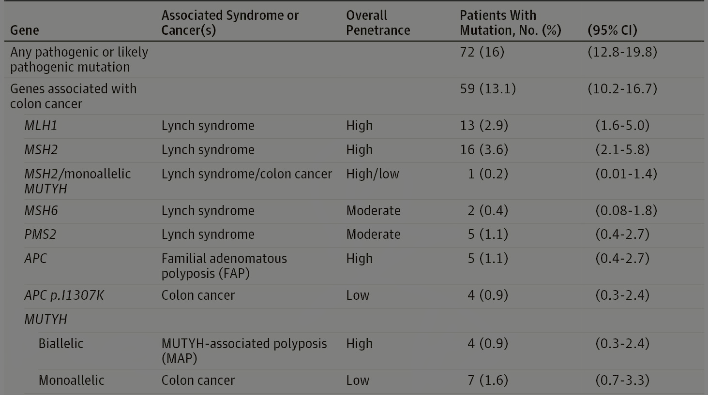
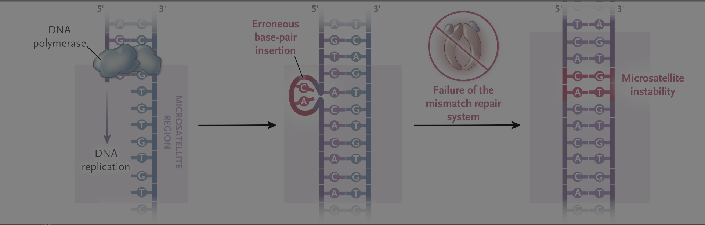
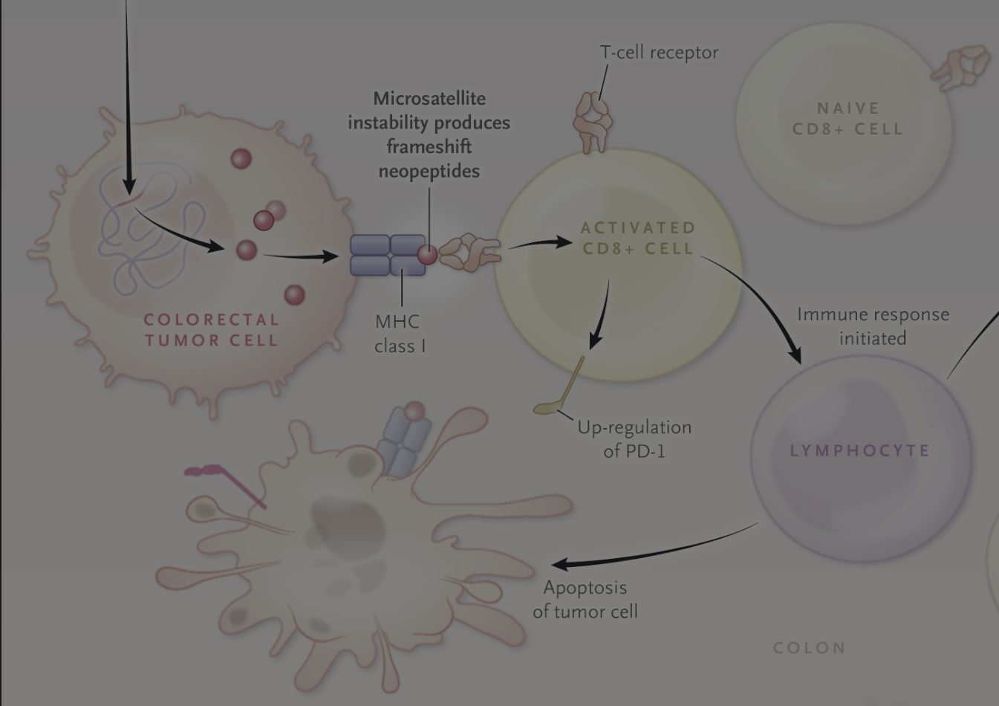
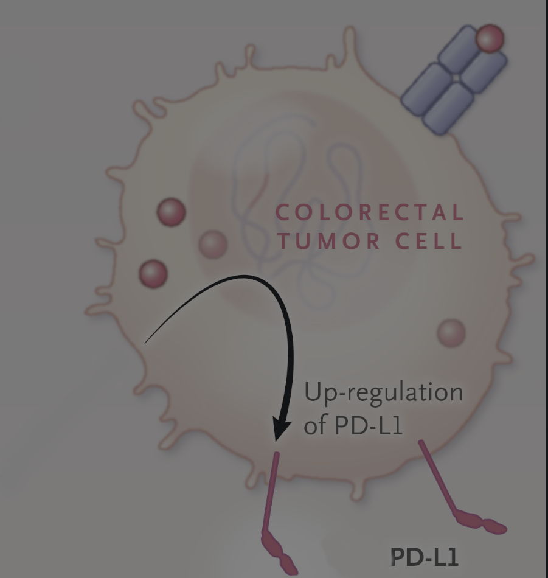
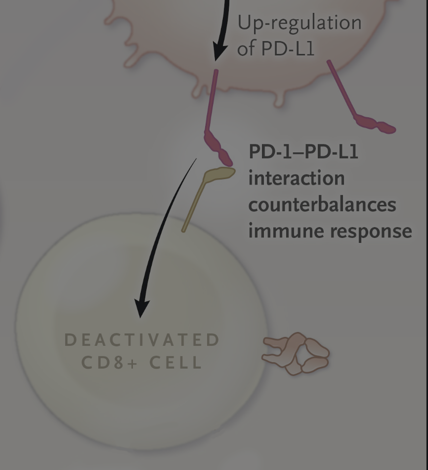
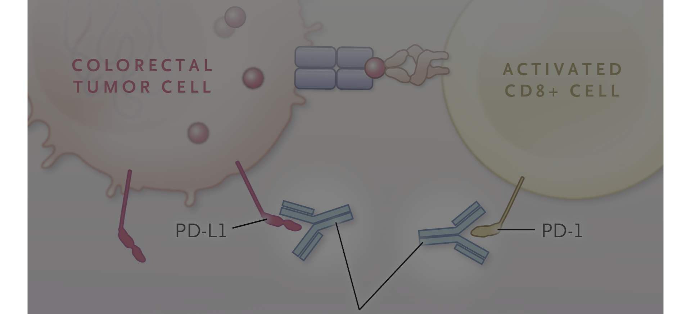

## Genetics of Colorectal Cancer

Genes associated with early-onset colorectal cancer

::: aside
Prevalence and Spectrum of Germline Cancer Susceptibility Gene Mutations Among Patients With Early-Onset Colorectal Cancer. JAMA Oncol. March 31, 2017.
:::

## Genetics 1920 x 900

::: aside
JAMA Oncol March 31, 2017
:::

## FAP screening

Colonoscopy age 10-12 EGD for duodenal polyps at age 20-30 CT 1-3 years after colectomy and q5 yers in those with family hx of desmoids

## Lynch Syndrome

- 3% of all colorectal cancers
- Germline mutations of mismatch repair genes
  - *OR* Germline deletions in EPCAM gene
- 80% lifetime risk colorectal cancer
- Early onset ($/tilde{x}$ 45-60yrs)
- Tumors tend to be right-sided

::: aside
A Comprehensive Framework for Early-Onset Colorectal Cancer Research.
The Lancet. Oncology. 2022. Eng C, Jácome AA, Agarwal R, et al.
:::

## Lynch Non-Colorectal Cancers

-   Endometrial (25-60% penetrance)
-   Stomach
-   Ovarian (45-125??? penestrance)
-   Urinary tract
-   Biliary Tract
-   Small bowel
-   Male breast cancer (1.2% penetrance vs 0.1%)

::: aside
[@sinicrope]
:::

## Lynch Screening

Colonoscopy q1-2 years staring age 20-25

## Mismatch Repair Protein Loss in Lynch Syndrome

Lynch Syndrome can be caused by loss of expression of:

-   MLH1
-   PMS1
-   MSH6
-   MSH2
-   MSH5

## Mismatch-repair Deficient Colorectal Cancers

Deficiency in mismatch repair proteins $\rightarrow$ microsatellite instability

15% of colorectal cancers are MMR-deficient

- Sporadic - Promoter methylation of MLH1 by BRAF V600E mutation (10%)

- Lynch - Due to mutations in mismatch repair genes (5%)
90% of Lynch tumors are MMR-deficient

*Reflex testing for BRAF V600E mutation is essential for MMR-deficient tumors*

## Mismatch Repair Proteins and Microsatellite Instability

Deficiency in mismatch repair proteins $\rightarrow$ microsatellite instability

## Mismatch Repair and MSI Testing

MMR Protein expression can be detected by immunohistochemistry

- Routine testing of tumor for GI cancers at CMC
- Loss of MLH1 leads to loss of PMS2

Microsatellite Instability can be detected by pCR

- Tumors are not routinely tested for MSI at CMC

97-99%+ concordance between dMMR and MSI-High status

## MMR-deficient Tumor Clinical Feaures

- Proximal location
- Poor differentiation
- Mucinous histology
- Better prognosis (in early stage)
- Respond well to immunotherapy (ICI)
- Less responsive to 5-FU chemotherapy (in stage II)

::: aside
Deficient Mismatch Repair/­Microsatellite Unstable Colorectal Cancer: Diagnosis, Prognosis and Treatment.
European Journal of Cancer. 2022. Taieb J, Svrcek M, Cohen R, et al.
:::

## MMR-deficient Tumors are Immunogenic

Mutational burden from dMMR causes MSI-High tumors to be immunogenic

## Tumor PD-L1 Down-regulates Immune Responses

::::: {.columns align="center"} 
::: {.column width="50%"}
{fig-align="center"}
:::

::: {.column width="50%"}

:::
:::::

## Immune Checkpoint Inhibitors

Inhibition of PD-L1 and PD-1 interaction activates T cells

## PD-L1 expression is higher in MMR-deficient Colorectal Cancers

Immunohistochemistry analysis of 1800 colorectal cancer specimens:

PD-L1 was more often positive in dMMR (18.6%) than in MMR proficient (pMMR) cancers (4.1%; p < 0.0001)

::: aside
[@moller1210]
:::

## MSI-High Colorectal Cancers

Clinical Relevance of Microsatellite Instability in Colorectal Cancer.
Journal of Clinical Oncology : Official Journal of the American Society of Clinical Oncology. 2010. de la Chapelle A, Hampel H.

## BRAF V600E Colorectal Cancer Features

1. Age >70
2. Female
3. Proximal Right sided tumors
4. MLH1 hypermethylation
5. High grade and poor differentiation
6. More peritoneal and nodal metastasis
7. Less lung metastais

## Colon Polyposis: \>10 adenomatous polyps

-   Classical FAP
-   Attenuated FAP (AFAP)
-   MUTYH-associated polyposis (MAP)
-   Colonic adenomatous polyposis of unknown etiology (CPUE)

## Colon Polyposis: \>4 hamartomatous polyps

-   Puetz-Jaghers
-   Juvenile Polyposis Syndrome
-   Cowden Syndrome/PTEN Hamartoma Tumor Syndrome

## Serrated Colon Polyps

≥5 serrated polyps/lesions proximal to the rectum, all being ≥5 mm in size, with ≥2 being ≥10 mm in size OR \>20 serrated polyps/lesions of any size distributed throughout the large bowel, with ≥5 being proximal to the rectum

## FAP

(FAP) is caused by germline mutations in the APC gene and leads to the development of hundreds to thousands of colorectal adenomas, with nearly 100% risk of colorectal cancer if untreated. [4] 

## Attenuated FAP

\~30 polyps 70% penetrance by age 80 - mean age at dx 50-55

## References
