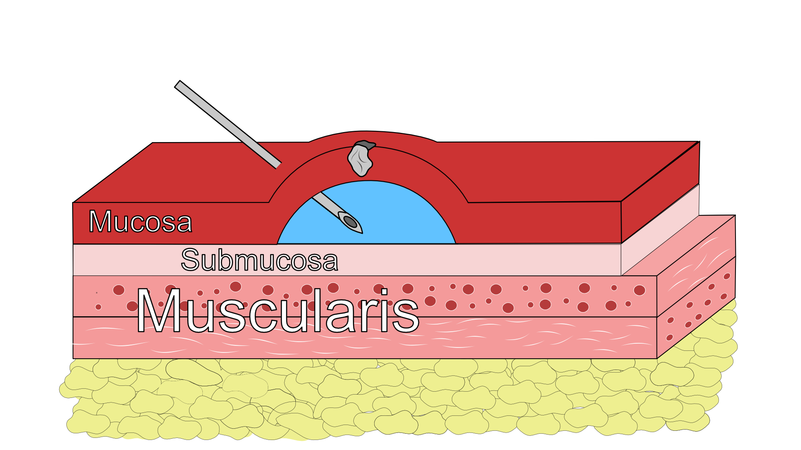
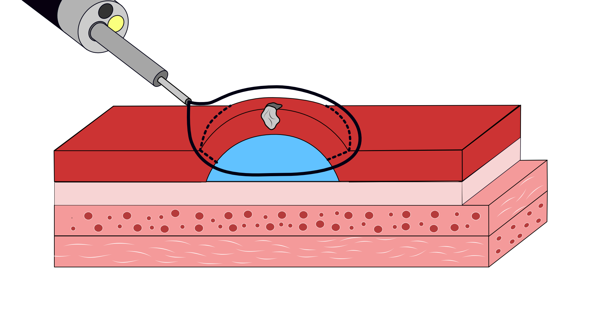
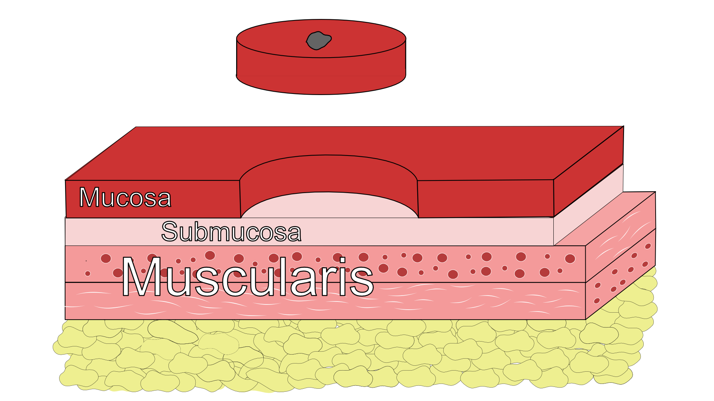
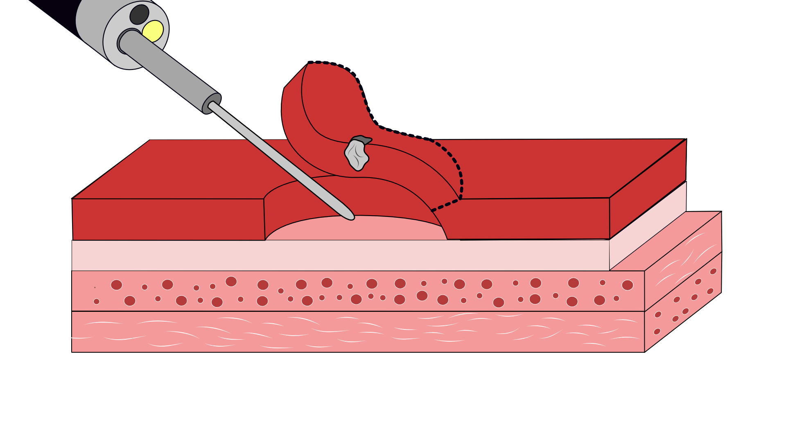
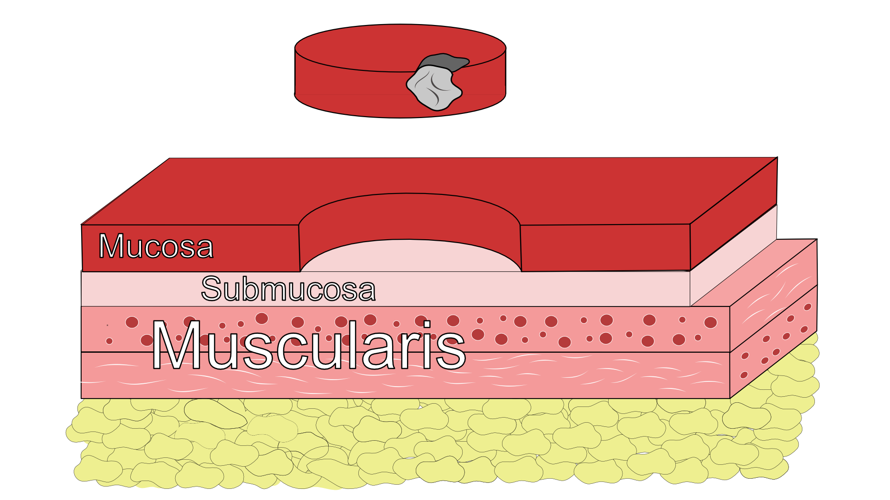
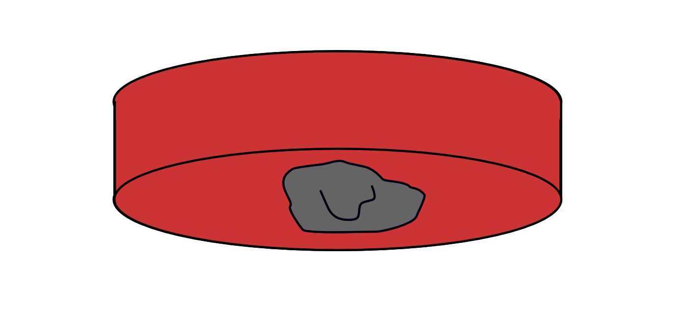

## Endoscopic Resection for T1 Tumors

::::: columns
::: {.column width="50%"}
Tumor Lifted with submucosal injection
:::

::: {.column width="50%"}

:::
:::::

## Endoscopic Mucosal Resection (EMR)

::::: columns
::: {.column width="50%"}

:::

::: {.column width="50%"}

:::
:::::

## Endoscopic Submucosal Dissection for T1a/T1b

::::: columns
::: {.column width="50%"}
Endoscopic resection uses needle-knife to dissect *below* submucosa

Maybe suitable for T1b lesions *if* lesion is completely resected

Risk of perforation
:::

::: {.column width="50%"}

:::
:::::

## Favorable Features after Endoscopic Resection

::::: columns
::: {.column width="50%"}
- Size \<2cm
- No lymphovascular invasion
- Clear peripheral margin
- Clear deep margin
:::

::: {.column width="50%"}

:::
:::::

## Unfavorable Features after Endoscopic Resection

::::: columns
::: {.column width="50%"}
- Positive lateral margin
- Lymphovascular invasion
- **Positive deep margin**
:::

::: {.column width="50%"}

:::
:::::

::: aside
:::

## Positive Deep Margin after Endoscopic Resection

::::: columns
::: {.column width="50%"}
Associated with higher risk of recurrence AND lymph node metastasis
:::

::: {.column width="50%"}

:::
:::::

