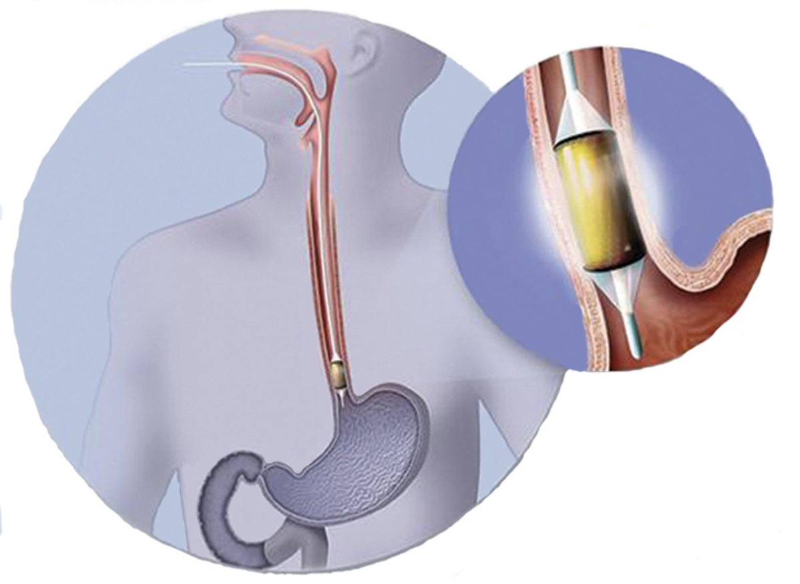
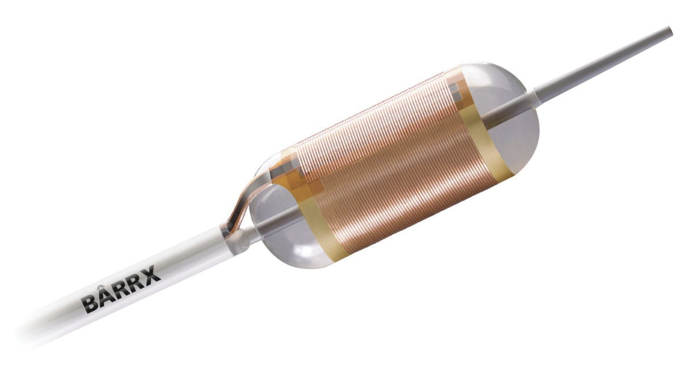
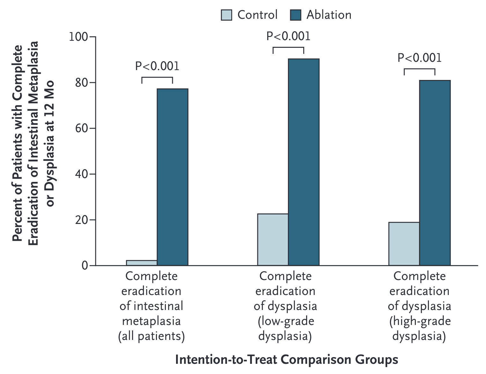
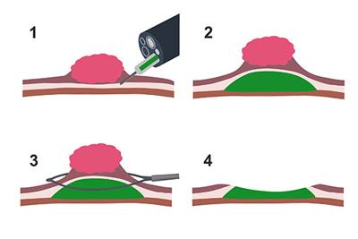
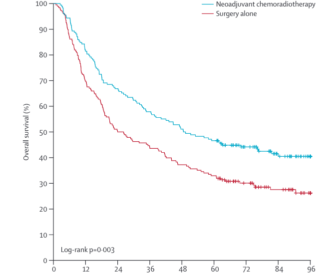
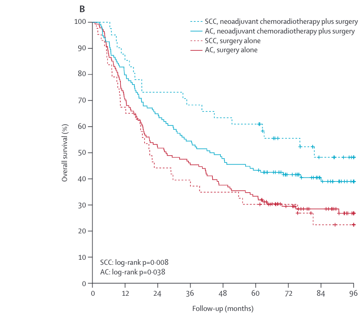
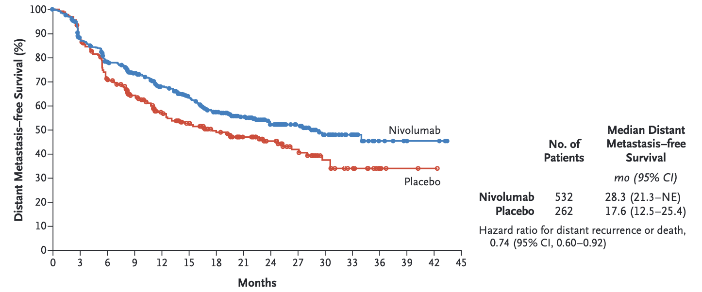
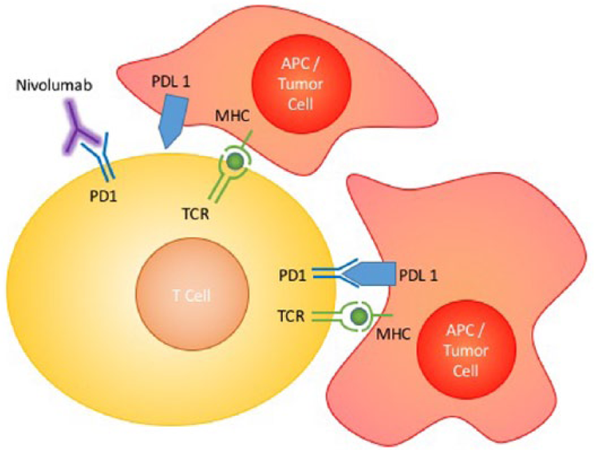
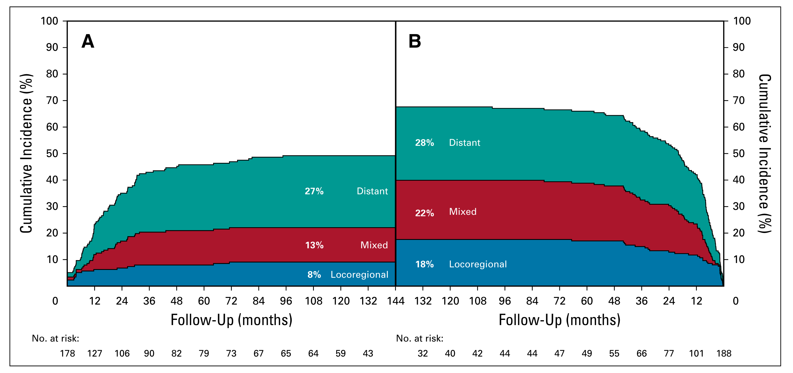

## Esophageal Cancer Treatment Categories

+-------------------------------------+------------+------------+-----------------------------+
| Category                            | AJCC       | Stage      | Treatment                   |
+=====================================+============+:==========:+:============================+
| [High-grade Dyplasia](#dysplasia)   | 0          | Tis        | Radiofrequency Ablation     |
+-------------------------------------+------------+------------+-----------------------------+
| [Superficial Tumors](#superficial)  | I          | T1a        | Endoscopic Therapy          |
+-------------------------------------+------------+------------+-----------------------------+
| [Localized Tumors](#localized)      | IIB        | T1b T2     | Surgery                     |
+-------------------------------------+------------+------------+-----------------------------+
| [Locally-advanced](#local_advanced) | III\       | T3 or N^+^ | Chemo $\pm$ RT → Surgery    |
|                                     | IIA        |            |                             |
+-------------------------------------+------------+------------+-----------------------------+
| [Extra-Regional](#extra_regional)   | IVA        | N3         | Chemo→ ChemoRT→ Surgery     |
+-------------------------------------+------------+------------+-----------------------------+
| [Metastatic](#metastatic)           | IVB        | M1         | Chemotherapy $\pm$Radiation |
+-------------------------------------+------------+------------+-----------------------------+

## High-grade Dyplasia =\> Radiofrequency Ablation {#dysplasia}

::::: columns
::: {.column width="60%"}
127 patients with dysplasia randomized:

-   Radio-frequency ablation
-   Sham ablation

Low-grade dysplasia in 64

High-grade dysplasia in 63
:::

::: {.column width="40%"}
 
:::
:::::

::: aside
[@shaheen2277]
:::

## Radiofrequency Ablation for Dysplasia

::::: columns
::: {.column width="30%"}
Radiofrequency Ablation results in eradication of Barrett's in 75% at 1 year
:::

::: {.column width="70%"}

:::
:::::

No role for primary surgery in high-grade dysplasia

::: aside
[@shaheen2277]
:::

## Superficial Tumors (T1) {#superficial}

Workup of nodular Barretts:

-   Endoscopic Ultrasound
-   Endoscopic Mucosal Resection
    -   Diagnostic (T staging)
    -   May be therapeutic for T1a tumors

## Endoscopic Musocal Resection for T1 Tumors

{fig-align="right"}

## Endoscopic Submucosal Dissection for T1a/T1b

Endoscopic resection uses needle-knife to dissect *below* submucosa

Maybe suitable for T1b lesions *if* lesion is completely resected

Risk of perforation

## Localized Tumors (T2 N0) {#localized}

Patients staged as uT2 N0 are candidates for primary surgery. *However:*

-   EUS has a 25% rate of understaging uT2 N0 tumors
-   Understaged patients who undergo primary surgery would need chemo or chemoRT postop

## Asymptomatic Tumors (minimal dysphagia)

-   EUS to distinguish T2 from T3 tumors
-   If uT2 N0 $\rightarrow$ CT chest/abdomen/pelvis $\rightarrow$ Esophagectomy
-   If uT3 or N1 $\rightarrow$ PET $\rightarrow$ neoadjuvant therapy

Patients with dysphagia almost always are T3 tumors (and don't need EUS)

## Symptomatic Tumors (dysphagia)

Patients with dysphagia to solids or weight loss or tumor length \>3cm are unlikely to have T1-2 tumors and can be initially evaluated with [PET Scan]

-   Disease confined to the esophagus and regional nodes $\rightarrow$ [Locally-advanced](#local_advanced)
-   Metastatic disease $\rightarrow$ [Metastatic](#metastatic)
-   N3 $\rightarrow$ [Extra-Regional](#extra_regional)

## EUS in Patients with Dysphagia

Memorial Sloan Kettering patients with esophageal cancer:

-   61 with dysphagia, 54 (89%) were found on EUS to have uT3-4 tumors.
-   53 without dysphagia, 25 (47%) were uT1-2 $\rightarrow$ candidates for primary surgery.

EUS can be omitted for patients with dysphagia

EUS can useful in patients *without* dysphagia (to identify T2N0 $\rightarrow$ Surgery)

::: aside
[@ripley226]
:::

## PET Scan

PET has more specificity and sensitivity than CT in detecting regional lymph node and distal metastasis

::: aside
:::

## Locally-advanced {#local_advanced}

Improved survival with adjunctive therapy. There are two options:

-   ChemoRT $\rightarrow$ Surgery ([CROSS Trial](#CROSS))
-   Chemo $\rightarrow$ Surgery $\rightarrow$ Chemo ([EsoPEC Trial](#EsoPEC))

## CROSS Surgery vs ChemoRT $\rightarrow$Surgery {#CROSS}

368 esophageal cancer patients randomized:

-   Surgery alone
-   Chemo+RT $\rightarrow$ Surgery

75% adenocarcinoma. T3: 80% T2: 17%. age $\tilde{x}$=60

$\Rightarrow$ longer survival with Chemo+RT $\rightarrow$ Surgery

Chemotherapy: Weekly carboplatin and paclitaxel

Radiation: 4140 cGy in 23 fractions (180cGy/fraction)

::: aside
[@shapiro1090]
:::

## CROSS Surgery vs ChemoRT $\rightarrow$Surgery

|                 | Surgeruy | CRT$\rightarrow$Surgery |          |
|-----------------|:--------:|:-----------------------:|----------|
| Time to Surgery |   24d    |           97d           |          |
| Unresectable    |   13%    |           4%            | p=0.002  |
| R0 Resection    |   92%    |           69%           | p\<0.001 |
| Positive Nodes  |   75%    |           31%           |          |
| Complications   |    \~    |           \~            |          |
| Mortality       |    \~    |           \~            |          |

## CROSS - Overall Survival

{fig-align="left"}

::: aside
[@shapiro1090]
:::

## CROSS - Survival by Histology

{fig-align="left"}

::: aside
[@shapiro1090]
:::

## CROSS Effects by Histology

Adenocarcinoma

-   Median survival 43mo vs 27mo
-   Pathologic complete response in 23%

Squmous Cell Carcinoma

-   Median survival 82mo vs 21mo
-   Pathologic complete response in 49%

[Surgical Therapy of Squamous Cell](#surgery_squamous)

::: aside
[@shapiro1090]
:::

## Adjuvant Nivolumab after CROSS: Checkmate 577 Trial {#Checkmate_577}

EsoCA patients who received ChemoRT$\rightarrow$ Surgery with residual disease (not pCR)

Randomized to one year of nivolumab vs Observation

$\Rightarrow$ Adjuvant nivolumab group had longer median survival: 22mo vs 11mo

::: aside
[@kelly1191]
:::

## Checkmate 577 Trial

{fig-align="left"}

::: aside
[@kelly1191]
:::

## Nivolumab = Immune Checkpoint Inhibitor (ICI)

::::: columns
::: {.column width="60%"}
PD-L1 agonist ligand

Interferes with tumor cell down-regulation of T cells

Active against stage IV esophageal cancer
:::

::: {.column width="40%"}

:::
:::::

## CROSS - ChemoRT Does Not Reduce Distant Failure

::::: columns
::: {.column width="30%"}
Sites of failure over time

ChemoRT + Surgery *vs* Surgery

ChemoRT appears to reduce risk of local or local+distant failure, but not isolated distant failure

$\Rightarrow$ Can chemotherapy reduce risk of distant failure?
:::

::: {.column width="70%"}

:::
:::::

::: aside
[@shapiro1090]
:::

## EsoPEC CROSS vs FLOT for Adenocarcionoma {#EsoPEC}

**Adenocarcinoma** esophagus and GE junction

-   T1 N+ or T2-4a M0. Median age =63. 89% men

Randomized to CROSS (n=217) vs FLOT chemotherapy (n=221)

-   CROSS: carboplatin/paclitaxel + 4140cGy $\rightarrow$ Surgery

-   FLOT: FLOT $\rightarrow$ Surgery $\rightarrow$ FLOT

Excluded: Squamous cell, gastric cancer, T1N0, T4b, M1

::: aside
[@hoeppner323]
:::

## EsoPEC: FLOT superior to CROSS

+----------------------+--------------+------------+------------+--------------+
|                      | FLOT\        | CROSS\     |            | CROSS Trial\ |
|                      | Periop Chemo | ChemoRT    |            | ChemoRT      |
+======================+==============+============+============+==============+
| 90d Mortality        | 3.2%         | 5.6%       |            |              |
+----------------------+--------------+------------+------------+--------------+
| $\tilde{x}$ Survival | 66mo         | 37mo       |            | 43mo         |
+----------------------+--------------+------------+------------+--------------+
| 3year Survival       | 57%          | 51%        |            | 58%          |
+----------------------+--------------+------------+------------+--------------+
| 5year Survival       | 51%          | 29%        |            | 47%          |
+----------------------+--------------+------------+------------+--------------+
| path CR              | 17%          | 10%        |            | 23%          |
+----------------------+--------------+------------+------------+--------------+

See also [Neoadjuvant Chemo](#NeoadjuvantChemo)

::: aside
[@hoeppner323]
:::

## Surgery for Squamous Cell Carcinoma {#surgery_squamous}

Squamous Cell Carcinoma of the esophagus

-   responds well to chemo+RT
-   more difficult to get a surgical margin on the airway
-   additional benefit of surgery on top of chemoRT is uncertain

## Squamous Cell: ChemoRT $\pm$ Surgery (FFCD)

Squamous cell of the esophagus $\rightarrow$ 4500cGy RT + 2 cycles of cisplatin + 5FU

Patients with a clinical response were randomized:

-   Surgery $\Rightarrow$ 2 year survival 34% Median 17.7mo

-   3 cycles of chemo + 2000 cGy RT $\Rightarrow$ 2 year survival 40% Median 19.3mo

:::: {style="color:red"}
$\Rrightarrow$ No difference in overall survival
::::

::: aside
[@bedenne1160]
:::

## Squamous Cell: ChemoRT $\pm$ Surgery (German)

Squamous cell of the esophagus randomized:

-   4000 cGY RT + Chemo $\rightarrow$ Surgery. 64% 2-year PFS. Mortality 12.8%

-   6500cGy RT + Chemo: 41% 2-year PFS. Mortality 3.5%

:::: {style="color:red"}
$\Rrightarrow$ No difference in overall survival
::::

::: aside
[@stahl2310]
:::

## Non-Operative Management

## Extra-regional Disease = N3 {#extra_regional}

Patients with N3 disease are Stage IVA and have a poor prognosis.

Treatment consists of chemotherapy followed by radiation.

Patients with persistent disease in the esophagus (and no distant disease) would then be candidates for surgery

## Metastatic = IVB {#metastatic}

FOLFOX is first-line systemic therapy for metastatic GI cancers

-   Dose-limiting toxicity is frequently peripheral neuropathy

## Adjuvant Immunotherapy: Checkmate 577 Trial {#checkmate_577}

Immunotherapy with nivolumab as adjuvant therapy after CROSS regimen for patients with residual disease

Stage II/II Esophageal or GE junction cancers Adenocarcinoma or squamous cell

ChemoRT $\rightarrow$ Surgery *with residual disease on pathology*

Treatment Group: Nivolumab every 2 weeks x 4 months $\rightarrow$ every month x 8 months

*vs*

Control Group: No adjuvant therapy

$\Rightarrow$ Better survival in group with adjuvant nivolumab

::: aside
[@kelly1191]
:::

## Neoadjuvant Chemo for EsoCA {#NeoadjuvantChemo}

-   MAGIC trial (gastric): ECF[^1]$\rightarrow$Surgery$\rightarrow$ECF *vs* Surgery\
-   [OEO2 Trial](#OEO2): (esophageal) Chemo$\rightarrow$Surgery$\rightarrow$ Chemo *vs* Surgery\
-   FLOT (gastric): FLOT[^2]$\rightarrow$Surgery$\rightarrow$ FLOT *vs* ECF$\rightarrow$Surgery$\rightarrow$ECF
-   [EsoPEC](#EsoPEC): (esophageal):FLOT$\rightarrow$Surgery$\rightarrow$FLOT *vs* ChemoRT$\rightarrow$Surgery (CROSS)

[^1]: Epirubicin, Cisplatin, 5FU

[^2]: 5FU, Leuvocorin, Oxaliplatin, Decetaxol

## OEO2 Clinical Trial {#OEO2}

-   802 Esophageal adenocarcinoma and squamous cell

-   Randomized to Chemo $\rightarrow$ Surgery $\rightarrow$ Chemo *vs* Surgery alone

-   Chemotherapy with ECF (Epirubicin, Cisplatin, 5FU)

-   5-year survival 23% for chemo+surgery vs 17% for surgery (HR 0.84 p=0.03)

::: aside
[@allum5062]
:::

## Neo-Aegis Tral CROSS vs MAGIC/FLOT {#NeoAEGIS}

-   **Adenocarcinoma** T2-3 N0-3 M0 Tumor length \<8cm

-   ChemoRT arm: carboplatin + paclitaxel + 4140cGy

-   Chemo arm: MAGIC (ECF) or FLOT (later in trial)

-   No difference in overall survival

-   R0 resection 96% with CROSS vs 82% with chemo

-   pCR 12% with CROSS vs 4% with chemo

::: aside
[@reynolds1015]
:::

## Orientation Manual



## References
