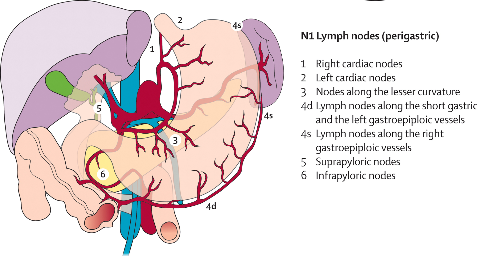
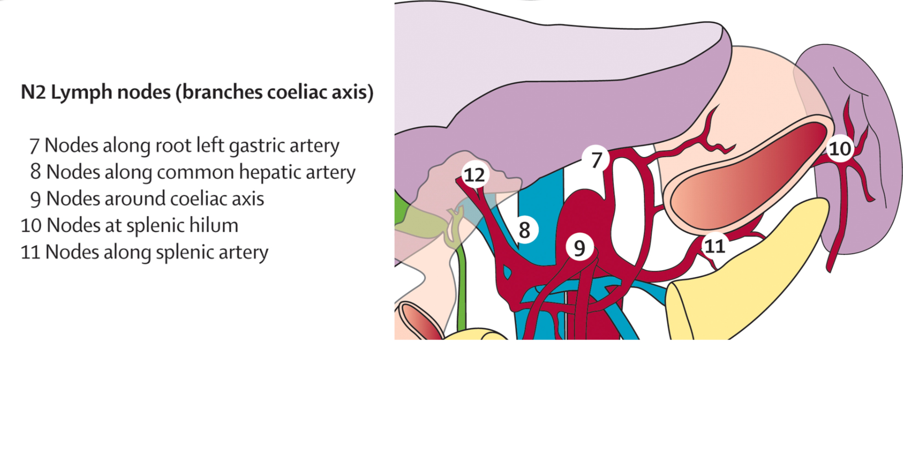
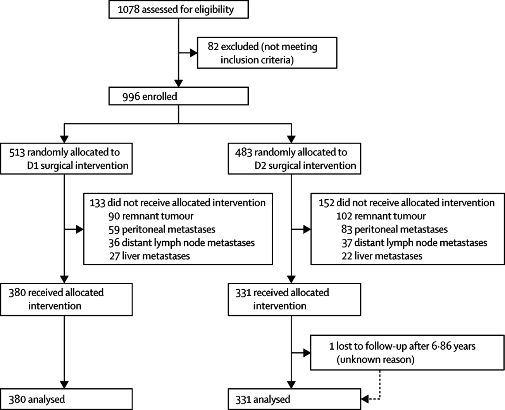
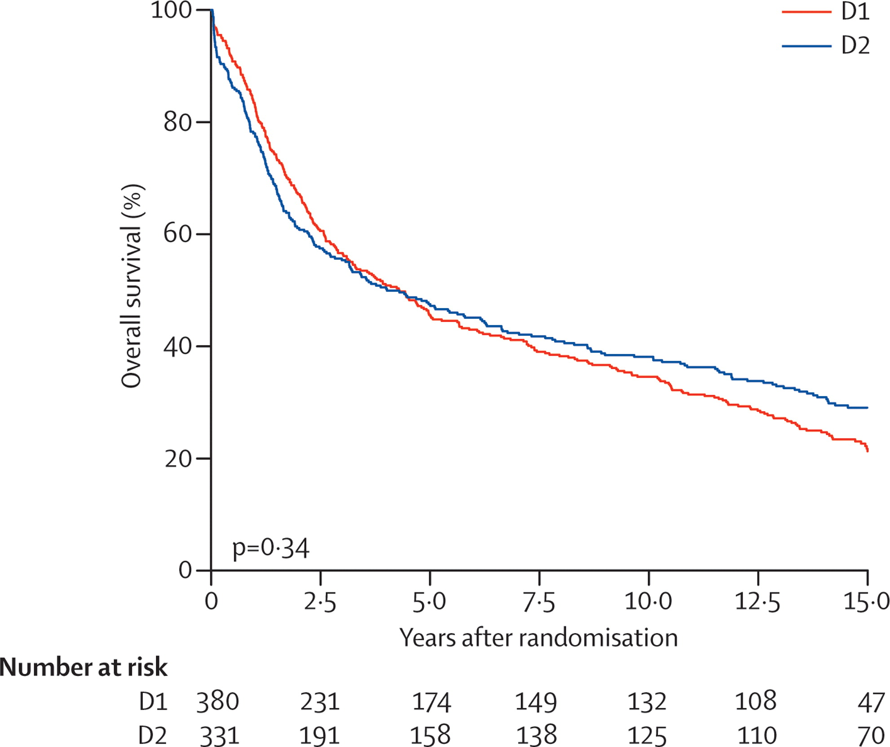
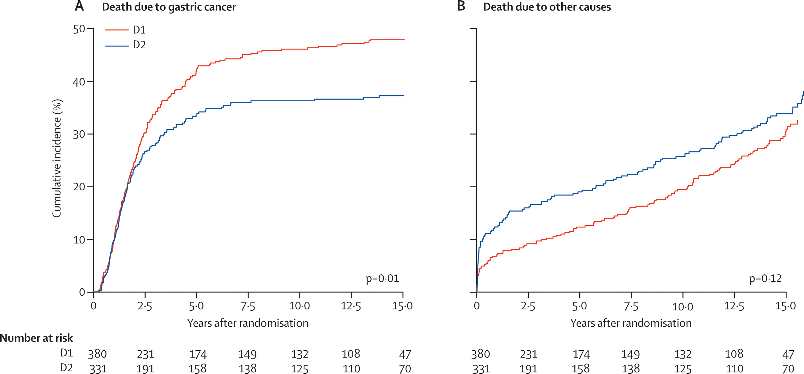
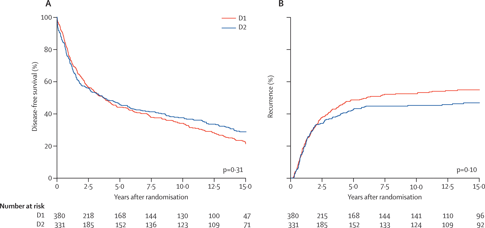
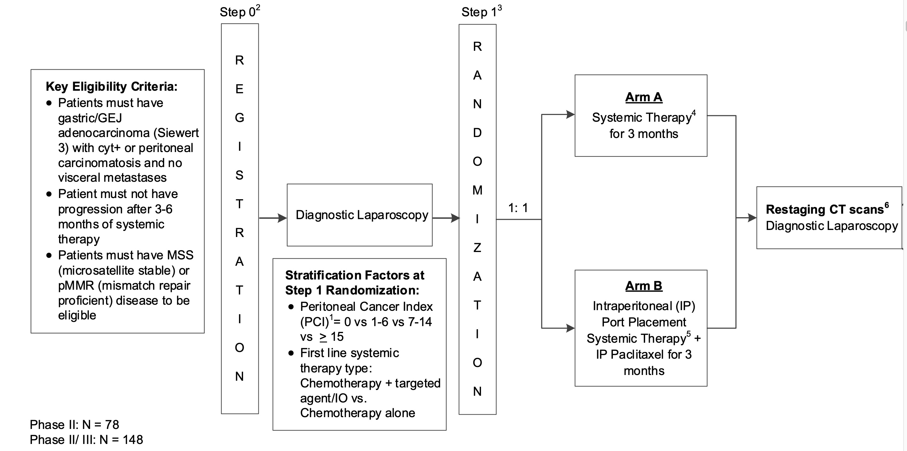
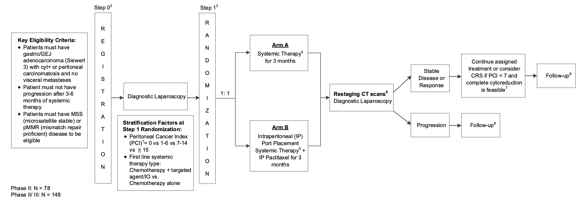

## Lymphadenectomy

Retrospective data from Japan in the 1980's suggested superior survival after extended lymphadenectomy for gastric cancer.

Extent of lympadenectomy can be categorized:

D1: Perigastric D2: Central nodes + splenic hilum D2$\alpha$: Central nodes D3: Extended nodes (peripancreatic, para-aortic, SMV=14V)

## D1 Perigastric nodes

Lymph node stations immediately adjacent to the stomach

- 1: Right cardia

- 2: Left cardia

- 3: Lesser curvature

- 4: Greater curvature

- 5: Suprapyloric

- 6: Infrapyloric

## D1 Perigastric Nodes

## D2 Central Nodes + splenic hilum

Lymph nodes adjacent to celiac axis:

- 12a: Left side of porta hepatis
- 8: Common hepatic artery
- 7: Left gastric artery
- 9: Celiac axis
- 11: Proximal splenic artery
- 10: Splenic hilum

## D1$\alpha$ Central Nodes

Lymph nodes adjacent to celiac axis:

- 12a: Left side of porta hepatis
- 8: Common hepatic artery
- 7: Left gastric artery
- 9: Celiac axis
- 11: Proximal splenic artery
- ~~10: Splenic hilum~~

## D2 Central Nodes

## Durch Trial: D2 vs D1 Lymphadenectomy

## Dutch Trial: Overall Survival

 \## Durch Trial: D2 vs D1 Lymphadenectomy

## Durch Trial: Cause of Death

## Durch Trial: Disease-free Survival

## Durch Trial: D2 vs D1 Lymphadenectomy

## Dutch Trial: D2 vs D1

Operative mortality higher with D2 (10% vs 4%)

More complications wtih D2 (43% vs 25%)

More reoperations with D2 (18% vs 8%)

## Dutch Trial: Total vs Subtotal gastrectomy

Protocol did not dictate extend of gastric resection, but did require a proximal margin of 5cm if a subtotal gastrectomy performed.

No difference in survival between total vs subtotal gastrectomy

## Dutch Trial: Conclusions

D2 lymphadenectomy is associated with better local control of gastric cancer than D1 node dissection, but at an increased risk of mortality and complications.

Can the toxicity of extended lymphadenectomy be reduced?

- Elimination of splenectomy (D1$\alpha$)
- Mininally-invasive techniques

## Splenectomy vs Splenic Preservation

505 patients with proximal gastric adenocarcinoma not invading the greater curvature treated with total gastrectomy randomized to with or without spleenectomy. Splenectomy associated with higher morbidity and larger blood loss.

No difference in 5-year survival (75.1% vsl 76.4%)

::: aside
[@sano277]
:::

## Sentinel Node Biopsy in Early Gastric Cancer

Senorita trial Hur Lee Kim

## MAGIC Trial - Perioperative Chemotherapy

503 gastric cancer stage II adenocarcinoma of stomach, GE juncction or lower esophagus

ECF Chemo $\rightarrow$ Surgery $\rightarrow$ ECF Chemot vs Surgery alone

Chemotherapy: Epirubicin, ciplatin, 5FU

Surgery 3-6 weeks after last dose of chemo Chemo 6-12 weeks after surgery

## MAGIC - Perioperative Chemotherapy

Tumor Location

- Gastric 74%
- GE junction 11%
- Distal esophagus 15%

## MAGIC- Perioperative Chemotheray

Curative radical resection 79% with chemo vs. 70\$ (p=0.03)

Longer 5-year survival wtih chemo (36% vs 23%). p=0.0009

Complete chemotherapy regimen (6 doses) in only 42%

Of patients who completed preop chemotherapy and surgery, only 34% received postoperative chemotherapy.

## FLOT - Perioperative Chemotherapy

7616 patients with adenocarcinoma of GE junction or stomach randomized:

ECF $\rightarrow$ Surgery $\rightarrow$ ECF vs FLOT $\rightarrow$ Surgery $\rightarrow$

Longer survival with FLOT (median 50 months vs 35 months)

## TOPGEAR - Periop Chemo + Adjuvant ChemoRT

ECF $\rightarrow$ Surgery $\rightarrow$ ECF $\rightarrow$ ChemoRT

vs

ECF $\rightarrow$ Surgery $\rightarrow$ ECF

No difference in survival

## GASTRICHIP - HIPEC

Patients with peritoneal diseae ftrom gastro cancer.

Chemo $\rightarrow$ Surgery with cytoreduction $\rightarrow$ Chemo

vs

Chemo $\rightarrow$ Surgery with cytoreduction + HIPEC $\rightarrow$ Chemo

::: aside
[@glehen1]
:::

## GASTRICHIP

105 patients randomized 2014 - 2018. Trial closed due to slow accrual

55 patient treatment stopped prior to cytoreductive surgery due to disease progression

HIPEC with mitomycin and ciplatin for 60min at 42ªC.

Median survival 15 months in both groups (without a difference).

::: aside
[@glehen1]
:::

## PERISCCOPE-II

Comparison of cytoreductive surgery + HIPEC to systemic chemotherapy in patients with gastric cancer and peritoneal metastasis.

::: aside
[@koemans1]
:::

## CHIMERA Trial

FLOT + HIPEC vs FLOT + Surgery in advanced gastric cancer

## PREVENT

Diffuse-type gastric and GE junction adenocarcinoma:

FLOT $\rightarrow$ Gastrectomy + HIPEC $\rightarrow$ FLOT vs

FLOT $\rightarrow$ Gastrectomy $\rightarrow$ FLOT

::: aside
[@gotze1]
:::

## STOPGAP-II

Gastric and GE junction cancers with caracinomatosis

Chemo (3-6 month without progression) $\rightarrow$ laparoscopy with PCI Staging. Intraop randomization:

Intraperitoneal Taxol

vs

Additional chemotherapy

::: aside
Senthil
:::

## STOPGAP-II Schema

 \## STOPGAP-II Schema

