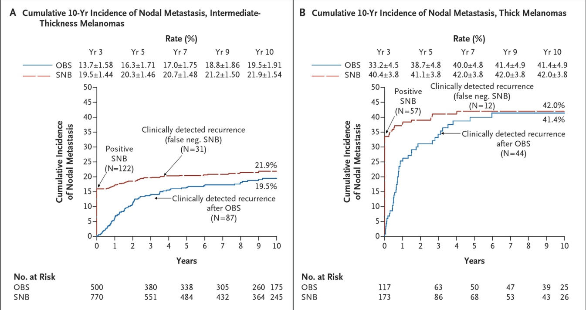
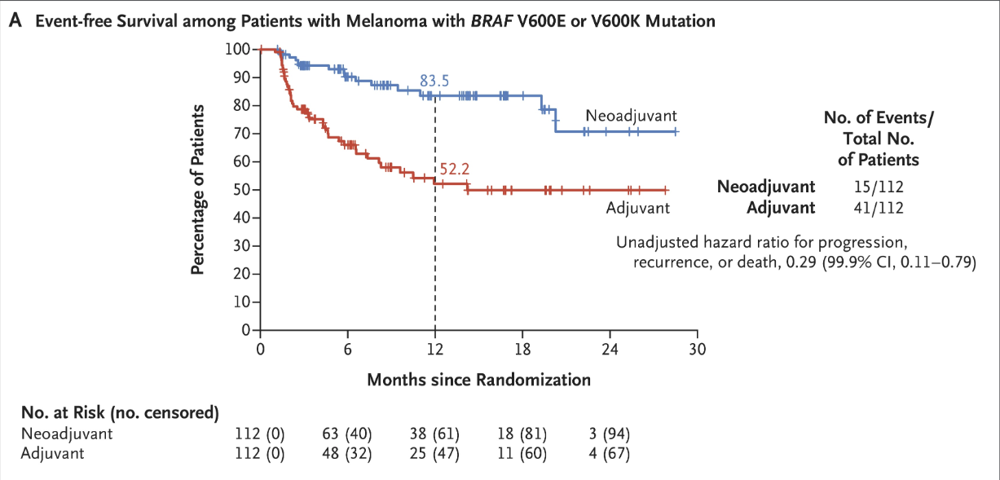
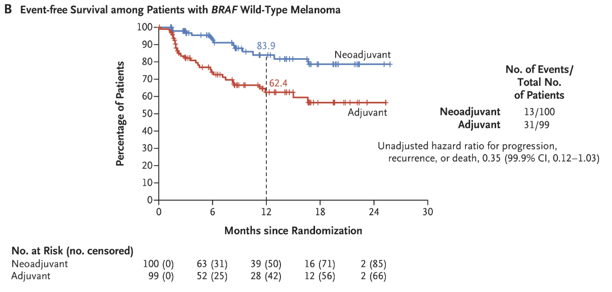
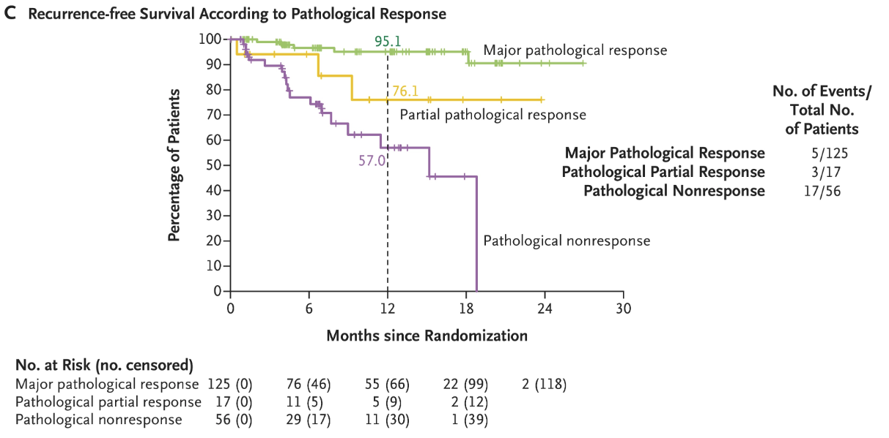

## Melanoma T Staging

+------------+-----------------------------+------------+----------------+
| T Category | Breslow Thickness           | Ulceration | SLN Positivity |
+============+=============================+============+================+
| Tis        | In situ                     | N/A        |                |
+------------+-----------------------------+------------+----------------+
| T1a        | 0.8mm                       | No         | 5%             |
+------------+-----------------------------+------------+----------------+
| T1b        | 0.8mm + ulceration or\      |            | 5-10%          |
|            | 0.8.-1.0mm $\pm$ ulceration |            |                |
+------------+-----------------------------+------------+----------------+
| T2a        | \>1.0-2.0mm                 | No         | \>10%          |
+------------+-----------------------------+------------+----------------+
| T2b        | \>1.0-2.0mm                 | Yes        |                |
+------------+-----------------------------+------------+----------------+
| T4a        | \>2.0-4.0mm                 | No         |                |
+------------+-----------------------------+------------+----------------+
| T4b        | \>2.0-4.0mm                 | Yes        |                |
+------------+-----------------------------+------------+----------------+
| T2a        | \>4.0mm                     | No         |                |
+------------+-----------------------------+------------+----------------+
| T2b        | \>4.0mm                     | Yes        |                |
+------------+-----------------------------+------------+----------------+

## T1a Melanoma

Stage IA (T1a): SLNB is not generally recommended for melanomas \<0.8 mm thick without ulceration or other adverse features, as the probability of a positive sentinel node is \<5%.

An exception is when there is significant uncertainty about the adequacy of microstaging (e.g., positive deep margins or limited sampling of a larger lesion).

## T1b Melanoma

Stage IB (T1b): SLNB should be considered for melanomas \<0.8 mm thick with ulceration or 0.8-1.0 mm thick (with or without ulceration), as the probability of a positive sentinel node is 5-10%.

\

For T1a lesions \>0.5 mm with other adverse features (age ≤42 years, head/neck location, lymphovascular invasion, and/or mitotic index ≥2/mm²), SLNB should be considered

## Stage IB (T2a) or Stage II (Tb2+)

SLNB should be offered for melanomas \>1.0 mm thick, as the probability of a positive sentinel node is generally \>10%. This includes intermediate-thickness melanomas (T2 or T3; 1.0-4.0 mm) where SLNB is recommended, and thick melanomas (T4; \>4.0 mm) where SLNB may be recommended after discussion of benefits and risks.

## MSLT-I Clinical trial

2,001 patients with melanoma $\ge$ 1.0mm randomized 40:60:

Wide Local Excision $\rightarrow$ Observation (with delayed completion node dissection)

vs

Wide Local Excision + SLNB (with immediate completion node dissection if positive)\
No difference in melanoma-specific survival

Slight improvement in disease-specific survival in intermediate and thick melanoma

::: aside
[@morton599]
:::

## MSLT-I Clinical trial

::: aside
[@morton599]
:::

## MSLT-I Clinical trial

Overall 20% of patients had lymph node metastasis

80% would not benefit from lymph node therapy

Study was underpowered to detect a difference in melanoma-specific survival

::: aside
[@morton599]
:::

## Excision Margins for Primary Melanoma

| **Breslow Thickness** | **Recommended Peripheral Surgical Margin** |
|-----------------------|--------------------------------------------|
| In situ               | 0.5–1 cm                                   |
| ≤1.0 mm (T1)          | 1 cm                                       |
| \>1.0–2.0 mm (T2)     | 1–2 cm                                     |
| \>2.0–4.0 mm (T3)     | 2 cm                                       |
| \>4.0 mm (T4)         | 2 cm                                       |

## Staging

Node positive patients are staged with "PET/CT Whole Body." This is different from PET used for staging GI cancers, which is "PET/CT Skull Base to Mid Thigh"

\

High risk patients will need either MRI or CT of brain

## Treatment of Positive Sentinel Node

Active nodal basin ultrasound without completion lymph node dissection (CLND) is now the preferred approach for patients with positive sentinel lymph node biopsy

Surveillance should include nodal ultrasound every 4 months during the first 2 years, then every 6 months during years 3 through 5, then annually

::: aside
[@wong399]
:::

## MSLT-II Trial

1,934 Patients with positive sentinel nodes were randomized:

Completion lymph node dissection\
vs\
Observation (with periodic ultrasound of the draining node basin)\
No difference in melanoma-specific survival

No difference in metastasis-free survival

Better disease-specific survival in CLND group (68% vs 63% at 3yrs)

::: aside
[@faires2211]
:::

## MSLT-II Trial

1,934 Patients with positive sentinel nodes were randomized:

Completion lymph node dissection\
vs\
Observation (with periodic ultrasound of the draining node basin)\

Non-sentinel lymph node metastasis was a negative prognostic factor

Lymphedema 24% with CLND vs 6.3% with SLNB and observation

Long-term: 80% of lymph node basins were free of nodal recurrence

::: aside
[@faires2211];[@crystal835]
:::

## Sentinel Node Biopsy for Pure Desomoplastic Melanoma

Pure desmoplastic melanoma (≥90% of invasive melanoma with prominent stromal fibrosis) has lower SLNB positivity rates (6%)

## Sentinel Node Biopsy for In-Transit Metastasis

SLNB may be considered for isolated in-transit metastasis or local recurrence if it will affect adjuvant therapy decisions.

## Stage III Treatment

BRAF V600 tumor mutation testing

IIIA T1a/b-T2a N1a OR N2a: Observation

- SLN Tumor deposits \$\le\$0.3mm: Low risk (similar to Stage IB)
- SLN Tumor deposits \$\ge\$0.3mm: Higher risk

IIIB/C - Higher risk: Perioperative Systemic Therapy

## NADINA Trial STAGE III Immunotherapy

423 Patients with III melanoma randomized:

Neoadjuvant ipilumimab + nivolumab x 2 $\rightarrow$ Surgery\
vs\
Surgery $\rightarrow$ Adjuvant nivolumab x 12

::: aside
[@blank1696]
:::

## NADINA Trial - Ipi/Nivo Neoadjuvant vs Adjuvant

 \## NADINA Trial - Ipi/Nivo Neoadjuvant vs Adjuvant

## NADINA Trial - Ipi/Nivo Neoadjuvant vs Adjuvant

## Adjuvant Systemic Therapy - Stage III B/C

Nivolumab - effective in AJCC 7th Edition stage IIIB/C disease

Pembrolizumab - effective in stage IIIA with SLN metastasis ≥1 mm or stage IIIB/C disease

Dabrafenib/trametinib - for BRAF V600 mutation-positive melanoma

\

Anti-PD-1 therapy (nivolumab, pembrolizumab) has shown improved 5-year recurrence-free survival compared to placebo or ipilimumab.

BRAF V600-mutant melanoma, dabrafenib/trametinib is an equally effective alternative to immunotherapy.

::: aside
[@seth4794]
:::

## Orientation Manual



## References

Cutaneous Melanoma. Lancet. 2023. Long GV, Swetter SM, Menzies AM, Gershenwald JE, Scolyer RA.

Cutaneous Melanoma. The Journal of the American Medical Association. 2025. Joshi UM, Kashani-Sabet M, Kirkwood JM.
