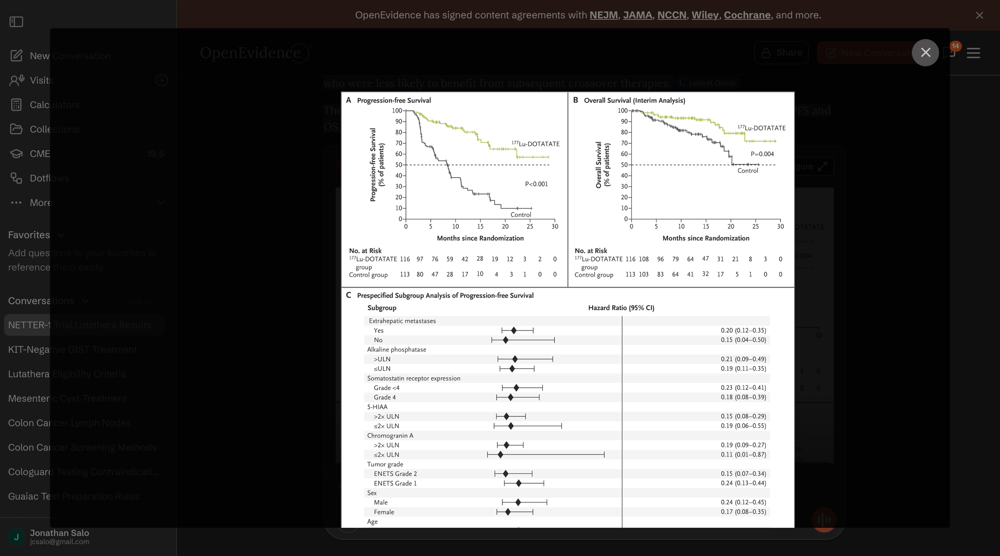

## Gastric Neuroendocrine Tumors

+------------------+-----------------+----------+----------+----------+
| Category         | Differentiation | Grade    | Mitotic\ | Ki-67\   |
|                  |                 |          | Rate     | Index    |
+==================+=================+==========+==========+==========+
| NET - Grade 1    | Well-diff       | Low      | \<2      | \<3%     |
+------------------+-----------------+----------+----------+----------+
| NET - Grade 2    | Well-diff       | Intermed | 2-20     | 3-20%    |
+------------------+-----------------+----------+----------+----------+
| NET - Grade 3    | Well-diff       | High     | \>20     | \>20%    |
+------------------+-----------------+----------+----------+----------+
| NEC - Large Cell | Poorly          | High     | \>20     | \>20%    |
+------------------+-----------------+----------+----------+----------+
| NEC - Small Cell | Poorly          | High     | \>20     | \>20%    |
+------------------+-----------------+----------+----------+----------+
| MiNEN            | Variable        | Variable | Variable | Variable |
+------------------+-----------------+----------+----------+----------+

## Mixed Neuroendocrine - Nonneuroendocrine Neoplasms

::: aside
Reference Here
:::

## Somatostatin Receptor (SSTR) PET for Staging

Frequently performed with ^68^Ga-DOTATATE Most useful for poorly-differentiated or high-grade tumors Less helpful for small tumors

## Gastric Neuroendocrine Tumors

Type 1 Multifocal Tumors - Driven by atrophic gastritis (70–80% of gastric NETs):

- Atrophic gastritis $\rightarrow$ $\downarrow$ gastric acid ($\uparrow$pH) $\rightarrow$ $\uparrow$ gastrin from G cells
- Gastrin is trophic for enterchromaffin-like (ECL) cells $\rightarrow$ Neuroendocrine tumors
- Small (\<1 cm), multifocal, well-differentiated, indolent

Type 2 Multifocal Tumors - Driven by Zollinger-Ellison Syndrome (rare)

- Gastrinoma produces high levels of gastrin and low gastric pH
- Generally have accompanying ulcer disease

Type 3 Sporadic Tumors - Autonomous growth (normal pH and normal gastrin)

Highest metastatic potential; most aggressive subtype

## Gastric Neuroendocrine Tumors

Type 1 Multifocal Tumors - Driven by atrophic gastritis (70–80% of gastric NETs):

- Atrophic gastritis $\rightarrow$ $\downarrow$ gastric acid ($\uparrow$pH) $\rightarrow$ $\uparrow$ gastrin from G cells
- Gastrin is trophic for enterchromaffin-like (ECL) cells $\rightarrow$ Neuroendocrine tumors
- Small (\<1 cm), multifocal, well-differentiated, indolent
- Small tumors \<1cm: Endoscopic resection
- Tumors 1-2cm: Endoscopic mucosal resection (EMR) or Endoscopic Submucosal Disssection (ESD)
- High risk tumors (\>2cm, Node^+^, Grade 3, muscle invasion): Surgical resection

## Gastric Neuroendocrine Tumors

Type 2 Multifocal Tumors - Driven by Zollinger-Ellison Syndrome (rare)

- Gastrinoma produces high levels of gastrin and low gastric pH
- Generally have accompanying ulcer disease
- Localization of gastrinoma (and resection) critical to treatment

## Gastric Neuroendocrine Tumors

Type 3 Sporadic Tumors - Autonomous growth (normal pH and normal gastrin)

Highest metastatic potential; most aggressive subtype

- Small tumors \<1cm: Endoscopic resection
- High risk tumors: Surgical resection with node dissection

## Mixed Neuroendocrine / Nonneuroendocrine Neoplasms

- Tumors showing neuroendocrine *and* nonneuroendocrine differentiation
- Tend to be aggressive with liver and nodal metastasis
- Origin from a single stem cell that then gives rise to two differentaition paths
- Small tumors treated with surgery
- Larger tumors treated with chemotherapy
- Also known as Mixed Adenoneuroendocrine Carcinoma (MANEC) 

::: aside
[@jacob721]
:::

## Lutathera Lu^177^-dotatate

- Radioactive-tagged dotatate (artificial somatostatin analogue)
- Indicated for treatment of somatostatin recpetor (SSTR)-positive tumors
- Gastroenterohepatic neuroendocrine tumors of foregut, midgut, and hindgut
- Dosed IV every 8 weeks x 4 doses, folloed by long-acting octreoride every 4 weeks

## NETTER-1 clinical trial

Eligibility criteria:

- Neuroendocrine tumors
- Ki-67 index \$\le\$20%
- OctreoScan positive in all lesions
- Disease progression on standard-dose octroetide

Randomized:

- ^177^Lu-dotatate q8 weeks x4 + octreotide LAR 30mg IM OR
- Octreotide LAR 60mg IM every4 weeks

|                                   | ^177^Lu-dotatate | Control |
|-----------------------------------|------------------|---------|
| Progression-free survival \@ 20mo | 65%              | 11%     |
| Median PFS                        | (not reached)    | 8.4mo   |
| Objective Response Rate           | 18%              | 3%      |
| Overall Survival Median           | 48mo             | 33mo    |
|                                   |                  |         |

Survival difference was likely diluted by crossovers at progression

More pronounced survival benefit for patients with KPS 60-80

## NETTER-1

## Lutathera indications for GI/Pancreatic tumors

- Well differentiated (Grade 1/2) tumors
  - Progression on octreodide LAR or lanreotide
  - Significant tumor burden and Ki-67 index \$\ge\$10% (first line)
- Well differentiated Grade 3 tumors
  - Favorable biology (Ki-67 10%-55%) - supported by NETTER-2 clinical trial

::: aside
Impact of Liver Tumour Burden, Alkaline Phosphatase Elevation, and Target Lesion Size on Treatment Outcomes With Lu-Dotatate: An Analysis of the NETTER-1 Study. European Journal of Nuclear Medicine and Molecular Imaging. 2020. Strosberg J, Kunz PL, Hendifar A, et al.'

Cost-Effectiveness of \[177Lu\]Lu-Dotatate for the Treatment of Newly Diagnosed Advanced Gastroenteropancreatic Neuroendocrine Tumors: An Analysis Based on Results of the NETTER-2 Trial. Journal of Nuclear Medicine : Official Publication, Society of Nuclear Medicine. 2025. Holzgreve A, Unterrainer LM, Tiling M, et al.
:::

## Netter-2 Trial - Grade 2/3 Neuroendocrine tumors

226 Patients with higher grade 2 (Ki67 ≥10% and ≤20%) and grade 3 (Ki67 \>20% and ≤55%), somatostatin receptor-positive gastroenteropancreatic neuroendocrine tumours

Treated with 4 cycles of Lutathera $\rightarrow$ Octreotide 30mg IM q4 wk

vs

Octreotide 60mg IM q4wk

Progression-free survival with Lutathera was 22.8mo (vs 8.5mo)

$\Rightarrow$ Lutathera is indicated for first-line therapy of higer grade neuroendocrine tumors

::: aside
[@singh2807]
:::
